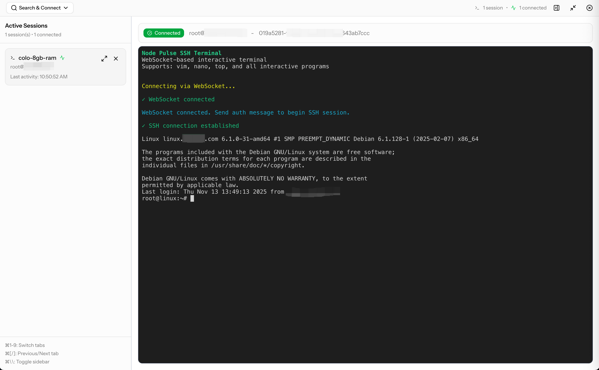

# Node Pulse Admiral

[English](#node-pulse-admiral) | [中文简介](README_CN.md)

**Production-ready server monitoring platform** with fully automated Ansible deployment, extensive playbook registry, real-time metrics collection, and integrated SSH terminal.

## Key Features

### Real-time Metrics Collection

- **Efficient agent-side parsing** - 98% bandwidth reduction (61KB → 1KB per scrape)
- **Comprehensive metadata** - Hostname, IP address, OS version, hardware specs
- **Minimal database footprint** - 99.8% reduction (1100+ rows → 1 row per scrape)
- **High-performance queries** - 10-30x faster with direct column access
- **15-second intervals** - Real-time visibility into system performance

### SSH Access Management

- **Encrypted SSH key storage** - Secure private key vault with master key encryption
- **Browser-based terminal** - WebSocket-powered SSH access directly from your dashboard
- **Session audit logging** - Complete audit trail of all SSH sessions for compliance

### Automated Deployment & Configuration

- **Playbook-based automation** - Deploy and configure applications using battle-tested Ansible playbooks
- **Built-in security playbooks** - SSH hardening, firewall configuration (UFW/firewalld), fail2ban, and more
- **Community playbooks** - Pre-built playbooks for databases (PostgreSQL, MySQL, Redis), web servers (Nginx, Caddy), Docker, and 30+ popular applications
- **Custom playbook upload** - Upload your own Ansible playbooks (.yml files or .zip packages) with validation and security scanning
- **Zero-touch agent deployment** - Fully automated monitoring stack installation (Node Pulse Agent + node_exporter + process_exporter)
- **Flexible security modes** - Support for both mTLS and non-mTLS configurations
- **Real-time deployment tracking** - Live output streaming and per-server status tracking

### Alert Management

- **Customizable alert rules** - Define thresholds for CPU, memory, disk, and network metrics
- **Alert history tracking** - Complete audit trail of all triggered alerts
- **Multi-channel notifications** - Email, Slack, webhook integrations (coming soon)

### User & Access Management

- **Multi-user authentication** - Enterprise-ready user management with Laravel Fortify
- **Session management** - Secure session handling with Redis-compatible Valkey
- **Two-factor authentication (2FA)** - TOTP-based 2FA with QR code setup and recovery codes
- **User management** - Create, update, and manage user accounts with role-based access control
- **Password confirmation** - Required for sensitive operations like enabling 2FA or mTLS

## Screenshots

### Server Management Dashboard


_Manage your server fleet with real-time status monitoring, SSH key management, and one-click terminal access_

### Browser-Based SSH Terminal


_Secure WebSocket-based SSH terminal for instant server access directly from your browser_

## Prerequisites

- Linux server (Ubuntu 22.04+ recommended)
- Docker Engine 24.0+
- Docker Compose v2.20+
- Root/sudo access
- Minimum 2GB RAM, 2 CPU cores

## Quick Start

### Production Deployment (Recommended)

**Download and deploy the latest release:**

```bash
# Download latest release
curl -LO https://github.com/node-pulse/admiral/releases/latest/download/node-pulse-admiral-latest.tar.gz

# Verify checksum (optional but recommended)
curl -LO https://github.com/node-pulse/admiral/releases/latest/download/node-pulse-admiral-latest.tar.gz.sha256
sha256sum -c node-pulse-admiral-latest.tar.gz.sha256

# Extract
sudo tar xzf node-pulse-admiral-latest.tar.gz -C /opt/admiral --strip-components=1

# Enter the extracted directory (e.g., node-pulse-admiral-0.8.7/)
cd /opt/admiral

# Run interactive deployment
sudo ./deploy.sh
```

The deployment script will:

- Guide you through configuration
- Set up mTLS certificates automatically
- Pull pre-built Docker images
- Create initial admin user
- Start all services

### Development / Manual Setup

**For development or manual setup from source:**

1. **Clone the repository**:

   ```bash
   git clone https://github.com/node-pulse/admiral.git
   cd admiral
   ```

2. **Copy environment file**:

   ```bash
   cp .env.example .env
   # Edit .env with your settings
   ```

3. **Start services** (development mode):

   ```bash
   docker compose -f compose.development.yml up -d
   ```

   This starts all services:

   - PostgreSQL (port 5432)
   - Valkey (port 6379)
   - Submarines Ingest (port 8080)
   - Submarines SSH WS (port 6001)
   - Submarines Digest (background worker)
   - Submarines Deployer (background worker)
   - Flagship (port 9000 + Vite HMR on 5173)
   - Caddy (port 8000)

   **Or** (production mode, with mTLS):

   ```bash
   sudo ./scripts/deploy.sh
   ```

4. **Check service status**:

   ```bash
   docker compose -f compose.development.yml ps
   ```

5. **View logs**:

   ```bash
   docker compose -f compose.development.yml logs -f

   # Or specific service
   docker compose -f compose.development.yml logs -f submarines-ingest
   docker compose -f compose.development.yml logs -f flagship
   ```

## Service URLs

Once all services are running (development mode):

- **Caddy Reverse Proxy**: http://localhost:8000 (routes to Flagship)
- **Flagship (Admin Dashboard)**: http://localhost:9000 (direct access)
- **Vite Dev Server** (HMR): http://localhost:5173
- **Submarines Ingest**: http://localhost:8080 (metrics endpoint)
- **Submarines SSH WS**: http://localhost:6001 (WebSocket terminal)
- **PostgreSQL**: localhost:5432
- **Valkey**: localhost:6379

## Database Schema

The PostgreSQL database uses a single **admiral** schema for all application data (shared by Submarines and Flagship):

- `servers`: Server/agent registry
- `metrics`: **Simplified metrics** - 39 essential metrics per row (98% bandwidth reduction vs raw Prometheus)
  - CPU: 6 fields (raw counter values)
  - Memory: 7 fields (bytes)
  - Swap: 3 fields (bytes)
  - Disk: 8 fields (bytes and I/O counters)
  - Network: 8 fields (counters for primary interface)
  - System: 3 load average fields
  - Processes: 3 fields
  - Uptime: 1 field
- `alerts`: Alert records
- `alert_rules`: Alert rule configurations
- `users`: User accounts (Laravel Fortify authentication)
- `sessions`: User sessions
- `ssh_sessions`: SSH session audit logs
- `private_keys`: SSH private keys for server access
- `settings`: Application settings

### Metrics Architecture

Node Pulse uses **agent-side parsing** for efficient metrics collection:

1. **node_exporter** runs on each server (localhost:9100)
2. **Node Pulse Agent** scrapes node_exporter locally
3. **Agent parses** Prometheus metrics and extracts 39 essential fields
4. **Agent sends compact JSON** (~1KB) to Submarines
5. **Submarines** writes to PostgreSQL (1 row per scrape)

**Benefits:**

- 98.32% bandwidth reduction (61KB → 1KB)
- 99.8% database reduction (1100+ rows → 1 row)
- 10-30x faster queries (direct column access vs JSONB)
- Distributed parsing load (offloaded to agents)

## API Endpoints

### Metrics Ingestion

**Primary Endpoint:**

```
POST http://your-domain/metrics/prometheus
```

Accepts simplified metrics format with 39 essential fields (agent-side parsed from Prometheus exporters).

**Request Format:**

```json
{
  "node_exporter": [
    {
      "timestamp": "2025-10-30T12:00:00Z",
      "cpu_idle_seconds": 7184190.53,
      "cpu_iowait_seconds": 295.19,
      "cpu_system_seconds": 2979.08,
      "cpu_user_seconds": 7293.29,
      "cpu_steal_seconds": 260.7,
      "cpu_cores": 4,
      "memory_total_bytes": 8326443008,
      "memory_available_bytes": 7920050176,
      ... (39 total fields)
    }
  ],
  "process_exporter": [
    {
      "timestamp": "2025-10-30T12:00:00Z",
      "name": "nginx",
      "num_procs": 4,
      "cpu_seconds_total": 1234.56,
      "memory_bytes": 104857600
    }
  ]
}
```

### Dashboard API

- `GET /api/servers` - List all servers
- `GET /api/servers/:id/metrics` - Get metrics for a specific server
- `GET /api/processes/top` - Get top N processes by CPU or memory
- `GET /health` - Health check endpoint

## Configuring Node Pulse Agents

The recommended deployment uses **node_exporter** + **Node Pulse Agent** with agent-side parsing:

### Architecture

```
node_exporter (localhost:9100) → Agent parses locally → Sends 39 metrics (1KB JSON) → Submarines
```

### Agent Configuration

Update your Node Pulse agent configuration (`/etc/nodepulse/nodepulse.yml`):

```yaml
# Prometheus scraper configuration
scrapers:
  prometheus:
    enabled: true
    endpoints:
      - url: "http://127.0.0.1:9100/metrics"
        name: "node_exporter"
        interval: 15s

# Server configuration
server:
  endpoint: "https://your-dashboard-domain/metrics/prometheus"
  format: "prometheus" # Sends parsed JSON in Prometheus format
  timeout: 10s

# Agent behavior
agent:
  server_id: "auto-generated-uuid"
  interval: 15s # How often to scrape and push

# Buffering (Write-Ahead Log for reliability)
buffer:
  enabled: true
  retention_hours: 48
  max_size_mb: 100

# Logging
logging:
  level: "info"
  file: "/var/log/nodepulse/nodepulse.log"
  max_size_mb: 50
  max_backups: 3
  max_age_days: 7
```

### Deployment via Ansible

Use the included Ansible playbooks to deploy both node_exporter and the agent:

```bash
# 1. Deploy node_exporter (must be deployed first)
ansible-playbook ansible/playbooks/prometheus/deploy-node-exporter.yml -i inventory.yml

# 2. Deploy Node Pulse Agent
# Production (with mTLS):
ansible-playbook ansible/playbooks/nodepulse/deploy-agent-mtls.yml -i inventory.yml

# Development (no mTLS):
ansible-playbook ansible/playbooks/nodepulse/deploy-agent-no-mtls.yml -i inventory.yml
```

See `ansible/playbooks/nodepulse/QUICK_START.md` for detailed deployment instructions.

## Development

### Submarines (Go-Gin Backend)

```bash
cd submarines
go mod download

# Run ingest server (receives agent metrics)
go run cmd/ingest/main.go

# Run digest worker (consumes from Valkey Stream, writes to PostgreSQL)
go run cmd/digest/main.go
```

### Flagship (Laravel Web Dashboard)

```bash
cd flagship
composer install
npm install

# Run development server (all services)
composer dev

# Or run individually
php artisan serve              # Laravel web server
npm run dev                    # Vite dev server
php artisan queue:listen       # Queue worker
php artisan pail               # Log viewer

# Other commands
php artisan migrate            # Run migrations
php artisan test               # Run tests
```

## Laravel + Inertia.js Stack

Flagship uses **Laravel 12** with **Inertia.js** for a modern SPA experience:

- **Backend**: Laravel for API, authentication, and business logic
- **Frontend**: React 19 with TypeScript
- **Routing**: Server-side routing via Inertia.js (no client-side router needed)
- **UI Components**: Radix UI + Tailwind CSS
- **Authentication**: Laravel Fortify with CAPTCHA support

### Creating New Pages

1. Create a controller in `flagship/app/Http/Controllers/`:

```php
<?php
namespace App\Http\Controllers;

use Inertia\Inertia;

class ExampleController extends Controller
{
    public function index()
    {
        return Inertia::render('example', [
            'data' => [...],
        ]);
    }
}
```

2. Create a React component in `flagship/resources/js/pages/`:

```tsx
// resources/js/pages/example.tsx
export default function Example({ data }) {
  return <div>Your page content</div>;
}
```

3. Add a route in `flagship/routes/web.php`:

```php
Route::get('/example', [ExampleController::class, 'index']);
```

## Stopping Services

```bash
# Stop all services (development)
docker compose -f compose.development.yml down

# Stop and remove volumes (WARNING: This deletes all data)
docker compose -f compose.development.yml down -v
```

## Updating Services

```bash
# Rebuild and restart a specific service (development)
docker compose -f compose.development.yml up -d --build submarines-ingest
docker compose -f compose.development.yml up -d --build submarines-digest
docker compose -f compose.development.yml up -d --build flagship

# Rebuild all services
docker compose -f compose.development.yml up -d --build
```

## Why Push-Based Architecture?

Node Pulse uses a **push-based** approach where agents actively send metrics to the dashboard, unlike traditional pull-based systems (e.g., Prometheus) that scrape metrics from targets. This provides significant advantages:

### Key Benefits

1. **Firewall-Friendly**: Agents can push metrics through firewalls, NAT, and network restrictions without requiring inbound ports to be exposed. This makes it ideal for:

   - Agents behind corporate firewalls
   - Servers with strict security policies
   - Cloud instances without public IPs
   - Edge devices with dynamic IPs

2. **Built-in Reliability**: Each agent has a local buffer that stores metrics when the dashboard is unreachable, ensuring:

   - No data loss during network outages or dashboard maintenance
   - Automatic retry with exponential backoff
   - Up to 48 hours of buffered metrics (configurable)

3. **Simplified Network Configuration**: No need to:

   - Open inbound firewall rules on monitored servers
   - Configure service discovery mechanisms
   - Maintain allowlists of scraper IPs
   - Set up VPN tunnels for monitoring access

4. **Real-time Data**: Metrics arrive as soon as they're collected (15-second default interval), providing:

   - Immediate visibility into system state
   - Faster incident detection and response
   - No scrape interval delays

5. **Scalability**: The dashboard scales independently from the number of agents:

   - Valkey Streams buffer incoming metrics during traffic spikes
   - Multiple digest workers process metrics in parallel
   - Horizontal scaling based on stream lag
   - No need to manage scrape scheduling and intervals

6. **Efficient Data Model**: Agent-side parsing with simplified metrics:
   - **98.32% bandwidth reduction** (61KB → 1KB per scrape)
   - **99.8% database reduction** (1100+ rows → 1 row per scrape)
   - **10-30x faster queries** with direct column access
   - Distributed parsing load (offloaded to agents, not central server)

## Architecture

Node Pulse Admiral uses a **push-based metrics pipeline** with Docker Compose orchestration:

### Metrics Data Flow

```
node_exporter (:9100) and process_exporter (:9256)
    │
    │ scrapes (HTTP)
    ▼
Node Pulse Agent - parses & extracts 39 metrics, WAL buffer
Node Pulse Agent - parses & extracts top N processes, WAL buffer
    │
    │ pushes JSON via HTTPS POST
    ▼
Submarines Ingest (:8080) - validates & publishes
    │
    │ streams to Valkey
    ▼
Valkey Streams (:6379) - message buffer & backpressure
    │
    │ consumes (batch of 100)
    ▼
Submarines Digest (worker) - batch insert
    │
    │ INSERT query
    ▼
PostgreSQL (:5432) - admiral.metrics + admiral.process_snapshots
```

### Component Architecture

**Submarines (Go) - Metrics Pipeline**

- **Ingest** (:8080) - Receives metrics from agents, publishes to Valkey Stream (~5ms response)
- **Digest** (worker) - Consumes from stream, batch writes to PostgreSQL
- **Deployer** (worker) - Executes Ansible playbooks for agent deployment
- **SSH WS** (:6001) - WebSocket terminal for server access

**Flagship (Laravel + React) - Management UI**

- Web dashboard with real-time charts
- Server management and configuration
- User authentication (Laravel Fortify)
- API endpoints for metrics and processes
- Served by Nginx (:8090) + PHP-FPM (:9000) inside container
- Exposed via Caddy reverse proxy in production

**Data Layer**

- **PostgreSQL 18** - Admiral schema (metrics, servers, users, alerts)
- **Valkey** - Message streams, caching, sessions (Redis-compatible)

**Reverse Proxy & Web Server**

- **Caddy** - Edge reverse proxy, TLS termination, automatic HTTPS, routes traffic between services
- **Nginx** - Application server for Flagship (serves static files, proxies PHP requests to PHP-FPM)

## Current Status (November 2025)

### Production-Ready Features ✅

- **Metrics Collection** - Simplified metrics architecture with 98% bandwidth reduction
- **Process Monitoring** - Top processes by CPU/Memory with time-series tracking
- **Ansible Deployment** - Unified playbook system with parallel execution (100 servers)
- **SSH Terminal** - WebSocket-based terminal with session audit logging
- **Data Retention** - Configurable retention policies (24h/48h/72h for free tier)
- **Two-Factor Authentication** - TOTP-based 2FA with recovery codes
- **Custom Playbooks** - Upload and execute custom Ansible playbooks
- **Community Playbooks** - 30+ pre-built playbooks for common applications
- **User Management** - Multi-user system with role-based access control
- **Server ID Validation** - 99% cache hit rate, DoS protection via negative caching
- **Security Playbooks** - SSH hardening and firewall configuration
- **mTLS Support** - Optional mutual TLS for agent authentication with one-click UI setup
- **Dashboard Metrics** - Real-time charts for CPU, memory, disk, and network

### In Progress 🔄

- **Playbook Testing** - Comprehensive testing on multiple Linux distributions (Ubuntu, Debian, RHEL/Rocky)
- **Documentation** - User guides and video tutorials

### Upcoming Features 🔮

See [Roadmap](docs/roadmap.md) for detailed plans:

- Scheduled deployments (Q1 2026)
- Advanced inventory management (Q2 2026)
- Deployment audit trail (Q2 2026)
- Credential vault integration (Q4 2026)
- Git integration for playbooks (Q3 2027)

## Troubleshooting

### Services won't start

Check logs for specific services:

```bash
docker compose -f compose.development.yml logs submarines-ingest
docker compose -f compose.development.yml logs submarines-digest
docker compose -f compose.development.yml logs submarines-deployer
docker compose -f compose.development.yml logs flagship
docker compose -f compose.development.yml logs postgres
docker compose -f compose.development.yml logs valkey
```

### Database connection issues

1. Ensure PostgreSQL is healthy:

   ```bash
   docker compose -f compose.development.yml ps postgres
   ```

2. Check database logs:

   ```bash
   docker compose -f compose.development.yml logs postgres
   ```

3. Verify connection from Submarines:
   ```bash
   docker compose -f compose.development.yml exec submarines-ingest sh
   # Inside container:
   # Check if postgres is reachable on port 5432
   ```

### Valkey connection issues

```bash
docker compose -f compose.development.yml logs valkey
docker compose -f compose.development.yml exec valkey valkey-cli --raw incr ping
```

### Flagship (Laravel) issues

1. Check Laravel application logs:

   ```bash
   docker compose -f compose.development.yml logs flagship
   # Or check mounted logs
   tail -f logs/flagship/laravel.log
   ```

2. Access Laravel container:

   ```bash
   docker compose -f compose.development.yml exec flagship bash
   php artisan about  # Show Laravel environment info
   ```

3. Check frontend build:
   ```bash
   # Inside flagship container
   npm run build  # Production build
   npm run dev    # Development with hot reload
   ```

### Frontend won't load

1. Check if Vite dev server is running:

   ```bash
   docker compose -f compose.development.yml logs flagship | grep vite
   ```

2. Ensure Submarines API is accessible:
   ```bash
   curl http://localhost:8080/health
   ```

### Valkey Streams issues

Check stream lag (how many messages are waiting to be processed):

```bash
docker compose -f compose.development.yml exec valkey valkey-cli \
  --raw XPENDING nodepulse:metrics:stream nodepulse-workers
```

If lag is high, consider scaling digest workers.

## Production Deployment

For production:

1. Update all secrets in `.env`
2. Use `production` target in Dockerfiles
3. Set `GIN_MODE=release` for Submarines
4. Set `APP_ENV=production` and `APP_DEBUG=false` for Flagship
5. Run `php artisan optimize` for Laravel optimization
6. Build frontend assets with `npm run build`
7. Configure proper domain in `.env` (FLAGSHIP_DOMAIN)
8. Use `Caddyfile.prod` for automatic HTTPS via Let's Encrypt
9. Set up proper backup strategy for PostgreSQL
10. Configure monitoring and alerting
11. Scale digest workers based on Valkey Stream lag
12. Configure Laravel authentication and authorization
13. Set up proper session and cache drivers

## License

[Apache 2.0](LICENSE)

## Support

For issues and questions, please open an issue on GitHub.
